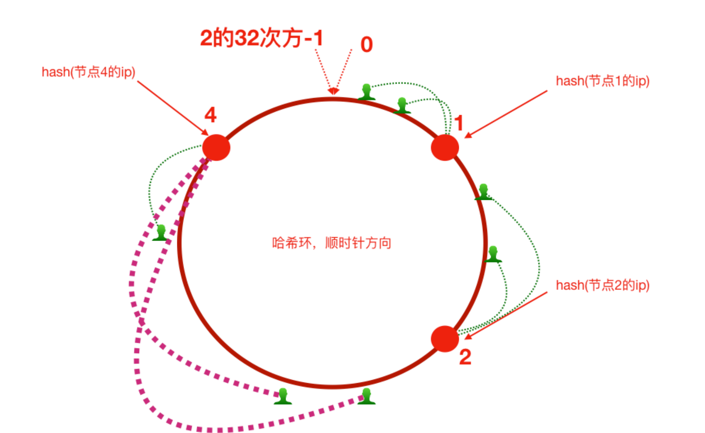
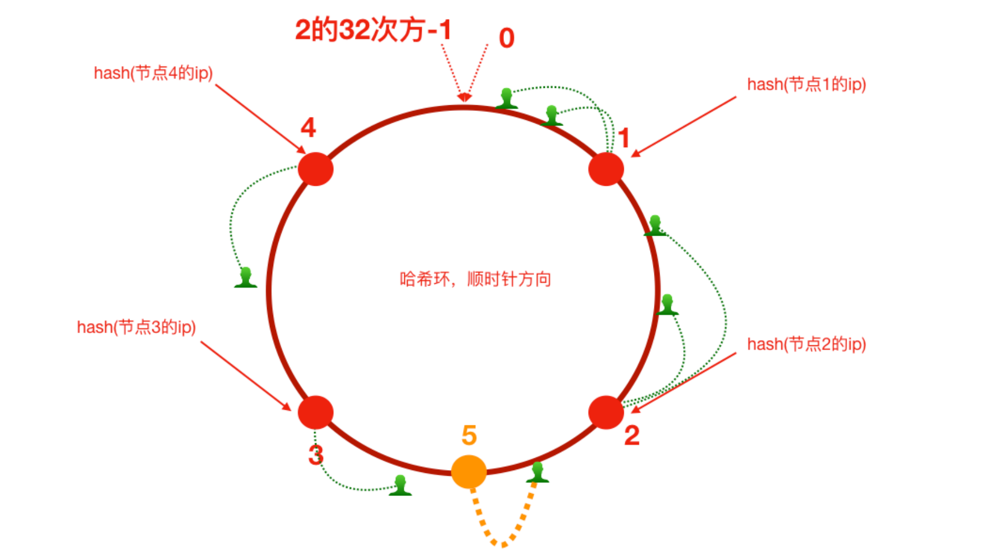
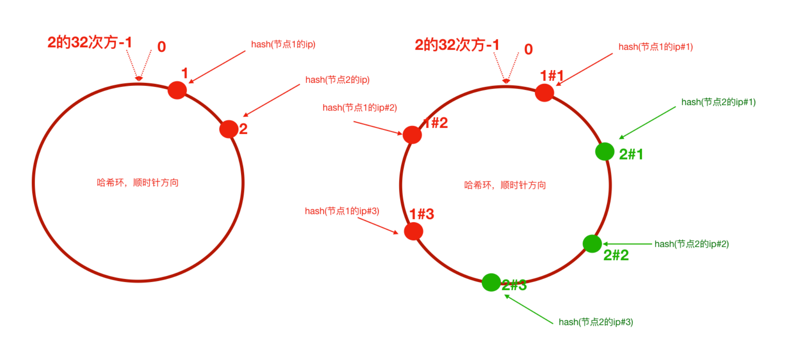
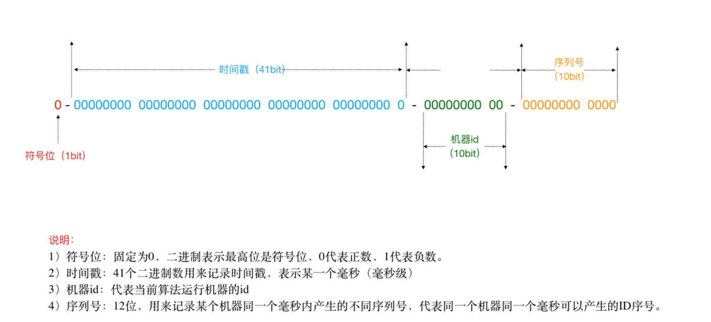
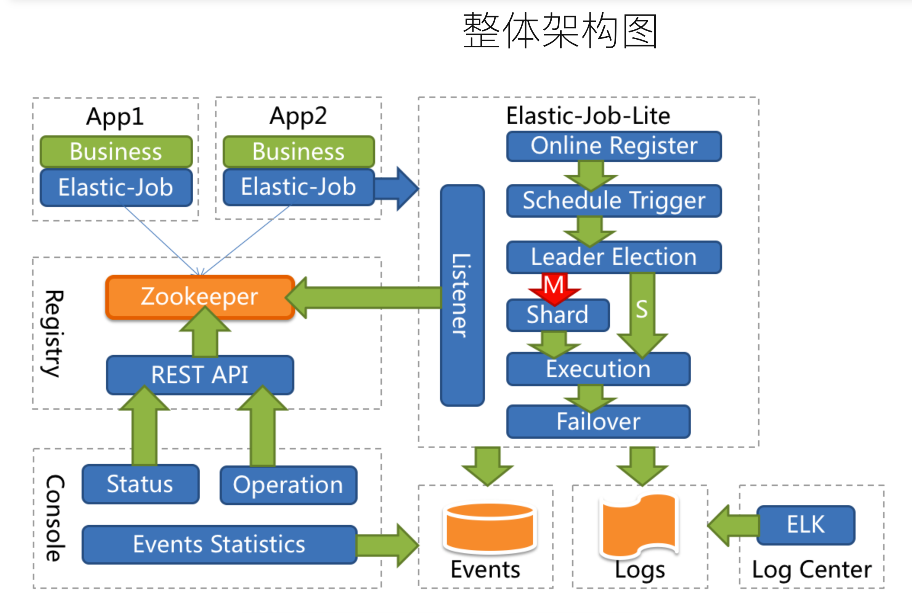
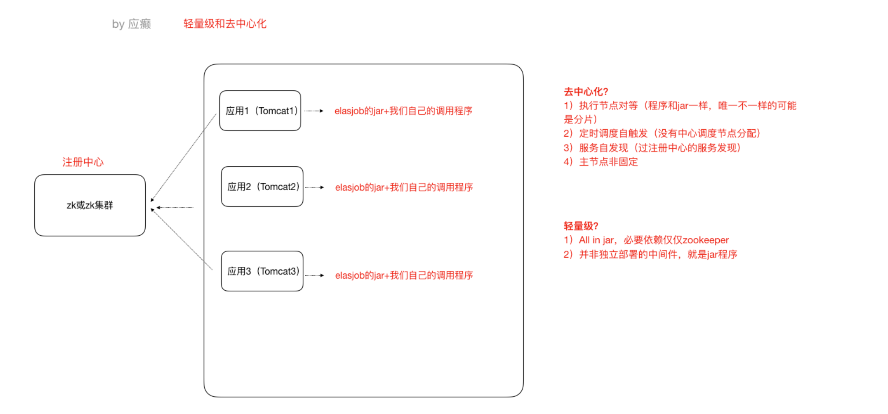
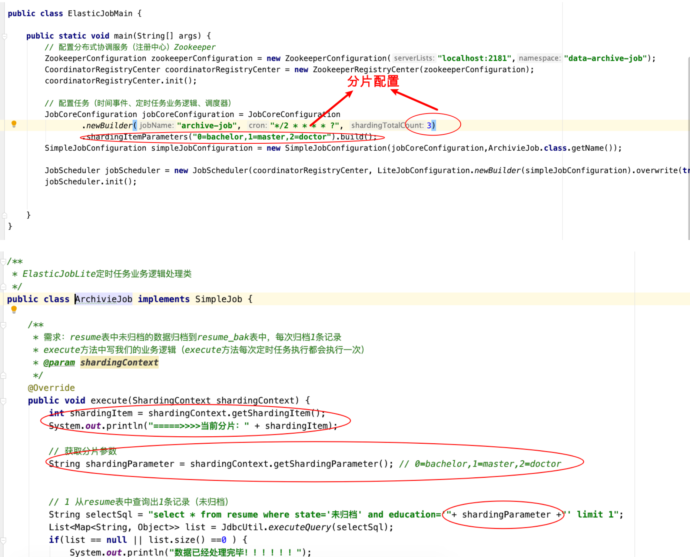
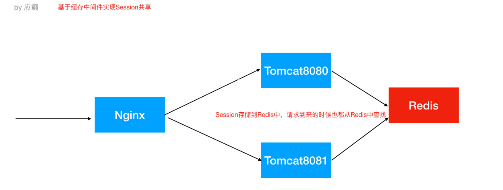
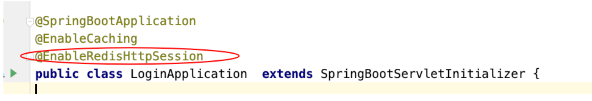
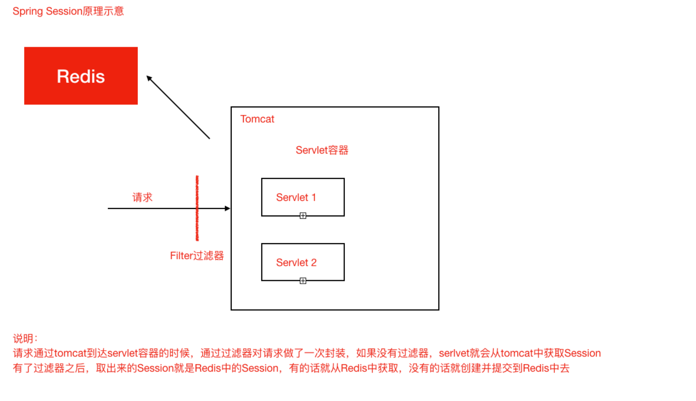

## 分布式集群架构场景化解决⽅案

分布式和集群：分布式和集群是不⼀样的，**分布式⼀定是集群，但是集群不⼀定是分布式**

（因为集群就是多个实例⼀起⼯作，分布式将⼀个系统**拆分**之后那就是多个实例；集群并不⼀定是分布式，因为复制型的集群**不是拆分⽽是复制**）


### 1.Hash算法

#### 1.1**Hash**算法应⽤场景

Hash算法在很多分布式集群产品中都有应⽤，⽐如分布式集群架构Redis、Hadoop、ElasticSearch，Mysql分库分表，Nginx负载均衡等

**主要的应⽤场景归纳起来两个**

> - **请求的负载均衡（⽐如nginx的ip_hash策略）**
>
> Nginx的**IP_hash**策略可以在客户端ip不变的情况下，将其发出的请求始终路由到同⼀个⽬标服务器上，实现会话粘滞，避免处理session共享问题

> - **分布式存储**
>
> 以分布式内存数据库Redis为例,集群中有redis1，redis2，redis3 三台Redis服务器.
>
> 在进⾏数据存储时,<key1,value1>数据存储到哪个服务器当中呢？针对key进⾏hash处理hash(key1)%3=index, 使⽤余数index锁定存储的具体服务器节点

**普通hash算法存在的问题：**

> 以ip_hash为例，假定下载⽤户ip固定没有发⽣改变，现在tomcat3出现了问题，down机了，服务器数量由3个变为了2个，之前所有的求模都需要重新计算。
>
> 缩容和扩容都会存在这样的问题，⼤量⽤户的请求会被路由到其他的⽬标服务器处理，**⽤户在原来服务器中的会话都会丢失**。


#### 1.2 一致性hash算法

**hash环 缩容情况**



如果3号机器宕机 则受影响的只有原来2-3号机器之间的客户端。这些客户端的请求后续会路由到4号机器上。


**hash环 扩容情况**




如果现在扩容了5号服务器，并且5落在了2-3的中间，这需要会话迁移的客户端只有2-5号之间的客户端。影响较小


**数据倾斜问题**

> 如前所述，每⼀台服务器负责⼀段，⼀致性哈希算法对于节点的增减都只需重定位环空间中的⼀⼩部分数据，具有较好的容错性和可扩展性。但是，⼀致性哈希算法在服务节点太少时，**容易因为节点分部不均匀⽽造成数据倾斜问题**。例如系统中只有两台服务器，其环分布如下，节点2只能负责⾮常⼩的⼀段，⼤量的客户端请求落在了节点1上

**解决办法**

>为了解决这种数据倾斜问题，⼀致性哈希算法引⼊了虚拟节点机制，**即对每⼀个服务节点计算多个哈希，**每个计算结果位置都放置⼀个此服务节点，称为**虚拟节点**



### 2.集群时间同步

时钟此处指**服务器时间**，如果集群中各个服务器时钟不⼀致势必导致⼀系列问题。

**解决方案：**

- 分布式集群中各个服务器节点都可以连接互联⽹

```shell
#使⽤ ntpdate ⽹络时间同步命令
ntpdate -u ntp.api.bz #从⼀个时间服务器同步时间
```

windows有计划任务

Linux也有定时任务，crond，可以使⽤linux的定时任务，每隔10分钟执⾏⼀次ntpdate命令


- 分布式集群中某⼀个服务器节点可以访问互联⽹或者所有节点都**不能够访问互联⽹**

>选取集群中的⼀个服务器节点A(172.17.0.17)作为时间服务器（整个集群时间从这台服务器同步，**如果这台服务器能够访问互联⽹，可以让这台服务器和⽹络时间保持同步，如果不能就⼿动设置⼀个时间**）
>
>1. ⾸先设置好A的时间
>2. 把A配置为时间服务器（修改/etc/ntp.conf⽂件）
>
>```shell
>a、如果有 restrict default ignore，注释掉它
>b、添加如下⼏⾏内容
> restrict 172.17.0.0 mask 255.255.255.0 nomodify notrap # 放开局域⽹同步功能,172.17.0.0是你的局域⽹⽹段
> server 127.127.1.0 # local clock
> fudge 127.127.1.0 stratum 10
>c、重启⽣效并配置ntpd服务开机⾃启动
>	service ntpd restart
>  chkconfig ntpd on
>```
>
>3. 集群中其他节点就可以从A服务器同步时间了
>
>```shell
>ntpdate 172.17.0.17
>```


### 3.分布式Id解决方案

分库分表后数据记录id不能采用数据库自增方式，否则会出现重复

**解决方案：**

- **UUID（可以用 太长 无规律不推荐）**

**UUID** 是指Universally Unique Identififier，翻译为中⽂是通⽤唯⼀识别码产⽣重复 UUID 并造成错误的情况⾮常低，是故⼤可不必考虑此问题。

```java
java.util.UUID.randomUUID().toString()
```

- **独⽴数据库的⾃增ID (太麻烦 没啥用)**

  ⽐如A表分表为A1表和A2表，那么肯定不能让A1表和A2表的ID⾃增，那么ID怎么获取呢？我们可以单独的创建⼀个Mysql数据库，在这个数据库中创建⼀张表，这张表的ID设置为⾃增，其他地⽅需要全局唯⼀ID的时候，就模拟向这个Mysql数据库的这张表中模拟插⼊⼀条记录，此时ID会⾃增，然后我们可以通过Mysql的select last_insert_id() 获取到刚刚这张表中⾃增⽣成的ID.

  问题：

  >1）这⾥的createtime字段⽆实际意义，是为了随便插⼊⼀条数据以⾄于能够⾃增id。 
  >
  >2）使⽤独⽴的Mysql实例⽣成分布式id，虽然可⾏，但是性能和可靠性都不够好，因为你需要代码连接到数据库才能获取到id，性能⽆法保障，另外mysql数据库实例挂掉了，那么就⽆法获取分布式id了。
  >
  >3）有⼀些开发者⼜针对上述的情况将⽤于⽣成分布式id的mysql数据库设计成了⼀个集群架构，那么其实这种⽅式现在基本不⽤，因为过于麻烦了。

- **SnowFlake 雪花算法（可以⽤）**

雪花算法是⼀个算法，基于这个算法可以⽣成ID，⽣成的ID是⼀个long型，那么在Java中⼀个long型是8个字节，算下来是64bit，如下是使⽤雪花算法⽣成的⼀个ID的⼆进制形式示意：



- **借助Redis的Incr命令获取全局唯⼀ID（推荐）**

  Redis Incr 命令将 key 中储存的数字值增⼀。**如果 key 不存在，那么 key 的值会先被初始化为 0,然后再执⾏ INCR 操作。**

```xml
<dependency> 
  <groupId>redis.clients</groupId> 
  <artifactId>jedis</artifactId> 
  <version>2.9.0</version>
</dependency>
```

```java
Jedis jedis = new Jedis("127.0.0.1",6379);
try {
  long id = jedis.incr("my_id");
  System.out.println("从redis中获取的分布式id为：" + id);
} finally {
  if (null != jedis) {
  	jedis.close();
	} 
}
```


### 4.计划任务回顾问题（单服务模式）

什么是分布式任务调度？有两层含义

> - 运⾏在分布式集群环境下的调度任务（**同⼀个定时任务程序部署多份，只应该有⼀个定时任务在执⾏**）
>
> - 分布式调度—>定时任务的分布式—>定时任务的拆分（**即为把⼀个⼤的作业任务拆分为多个⼩的作业任务，同时执⾏**）

#### 4.1 定时任务和消息队列(MQ)的区别

- 共同点

>1. 异步处理
>
>⽐如短信验证码、下单事件
>
>2. 应⽤解耦
>
>不管定时任务作业还是MQ都可以作为两个应⽤之间的⻮轮实现应⽤解耦，这个⻮轮可以中转数据，当然单体服务不需要考虑这些，服务拆分的时候往往都会考虑
>
>3. 流量削峰
>
>双⼗⼀的时候，任务作业和MQ都可以⽤来扛流量，后端系统根据服务能⼒定时处理订单或者从MQ抓取订单抓取到⼀个订单到来事件的话触发处理，对于前端⽤户来说看到的结果是已经下单成功了，下单是不受任何影响的

- 不同点

>定时任务作业是时间驱动，⽽MQ是事件驱动；

**定时任务作业更倾向于批处理，MQ倾向于逐条处理；**


#### 4.2 Quartz任务回顾

1. **导入jar包**

```xml
<dependency> 
  <groupId>org.quartz-scheduler</groupId>
  <artifactId>quartz</artifactId> 
  <version>2.3.2</version>
</dependency>
```

2. **创建任务调度器**

```java
// 创建作业任务调度器（类似于公交调度站）
public static Scheduler createScheduler() throws SchedulerException {
    SchedulerFactory schedulerFactory = new StdSchedulerFactory();
    return schedulerFactory.getScheduler();
 }
```

3. **创建任务**

```java
public static JobDetail createJob() {
    JobBuilder jobBuilder = JobBuilder.newJob(DemoJob.class);
    jobBuilder.withIdentity("jobName","myJob");
    return jobBuilder.build();
}
```

4. **创建任务出发器**

```java
public static Trigger createTrigger() {
  // 创建时间触发器，按⽇历调度
  CronTrigger trigger = TriggerBuilder.newTrigger()
   .withIdentity("triggerName","myTrigger")
   .startNow()
    // 每隔两秒执行一次
   .withSchedule(CronScheduleBuilder.cronSchedule("0/2 * * * * ?"))
   .build();
  
  // 创建触发器，按简单间隔调度
  /*SimpleTrigger trigger1 = TriggerBuilder.newTrigger()
  .withIdentity("triggerName","myTrigger")
  .startNow()
  .withSchedule(SimpleScheduleBuilder
  .simpleSchedule()
  .withIntervalInSeconds(3)
  .repeatForever())
  .build();*/
	return trigger;
}
```

cron表达式

```java
/**
* 创建作业任务时间触发器（类似于公交⻋出⻋时间表）
* cron表达式由七个位置组成，空格分隔
* 1、Seconds（秒） 0~59
* 2、Minutes（分） 0~59
* 3、Hours（⼩时） 0~23
* 4、Day of Month（天）1~31,注意有的⽉份不⾜31天
* 5、Month（⽉） 0~11,或者JAN,FEB,MAR,APR,MAY,JUN,JUL,AUG,SEP,OCT,NOV,DEC
* 6、Day of Week(周) 1~7,1=SUN或者 SUN,MON,TUE,WEB,THU,FRI,SAT定义⼀个job，需实现Job接⼝
* 7、Year（年）1970~2099 可选项
*示例：
* 0 0 11 * * ? 每天的11点触发执⾏⼀次
* 0 30 10 1 * ? 每⽉1号上午10点半触发执⾏⼀次
*/
```


5. 组装发布任务

```java
// 定时任务作业主调度程序
public static void main(String[] args) throws SchedulerException {
    // 创建⼀个作业任务调度器（类似于公交调度站）
    Scheduler scheduler = QuartzMain.createScheduler();
    // 创建⼀个作业任务（类似于⼀辆公交⻋）
    JobDetail job = QuartzMain.createJob();
    // 创建⼀个作业任务时间触发器（类似于公交⻋出⻋时间表）
    Trigger trigger = QuartzMain.createTrigger();
    // 使⽤调度器按照时间触发器执⾏这个作业任务
    scheduler.scheduleJob(job,trigger);
    scheduler.start();
}
```


### 5.分布式调度框架**Elastic-Job**（弹性任务）

Elastic-Job是当当⽹开源的⼀个分布式调度解决⽅案，基于Quartz⼆次开发的。由两个相互独⽴的⼦项⽬Elastic-Job-Lite和Elastic-Job-Cloud组成

#### 5.1 **主要功能介绍**

>- **分布式调度协调**
>
>  在分布式环境中，任务能够按指定的调度策略执⾏，并且能够避免同⼀任务多实例重复执⾏
>
>- **丰富的调度策略** 
>
>  基于成熟的定时任务作业框架Quartz cron表达式执⾏定时任务
>
>- **弹性扩容缩容**
>
>  当集群中增加某⼀个实例，它应当也能够被选举并执⾏任务；当集群减少⼀个实例时，它所执⾏的任务能被转移到别的实例来执⾏。
>
>- **失效转移**
>
>  某实例在任务执⾏失败后，会被转移到其他实例执⾏
>
>- **错过执⾏作业重触发**
>
>  若因某种原因导致作业错过执⾏，⾃动记录错过执⾏的作业，并在上次作业完成后⾃动触发。
>
>- **⽀持并⾏调度 ⽀持任务分⽚**
>
>  任务分⽚是指将⼀个任务分为多个⼩任务项在多个实例同时执⾏。
>
>- **作业分⽚⼀致性**
>
>  当任务被分⽚后，保证同⼀分⽚在分布式环境中仅⼀个执⾏实例。



#### 5.2 Elastic-Job-Lite应用

Elastic-Job依赖于Zookeeper进⾏分布式协调，所以需要安装Zookeeper（**分布式协调服务**）软件（3.4.6版本**以上**）

Zookeeper的本质功能：**存储+通知**。

##### 5.2.1 快速入门

1.引入依赖

```xml
<!-- 引入elastic-job-lite核心模块 -->
<dependency>
    <groupId>io.elasticjob</groupId>
    <artifactId>elastic-job-lite-core</artifactId>
    <version>${latest.release.version}</version>
</dependency>

<!-- 使用springframework自定义命名空间时引入 -->
<dependency>
    <groupId>io.elasticjob</groupId>
    <artifactId>elastic-job-lite-spring</artifactId>
    <version>${latest.release.version}</version>
</dependency>
```

2. 任务开发

```java
public class MyElasticJob implements SimpleJob {
    
    @Override
    public void execute(ShardingContext context) {
        switch (context.getShardingItem()) {
            case 0: 
                // do something by sharding item 0
                break;
            case 1: 
                // do something by sharding item 1
                break;
            case 2: 
                // do something by sharding item 2
                break;
            // case n: ...
        }
    }
}
```

3. 任务配置 （使用spring配置方式启动）

```xml
<?xml version="1.0" encoding="UTF-8"?>
<beans xmlns="http://www.springframework.org/schema/beans"
    xmlns:xsi="http://www.w3.org/2001/XMLSchema-instance"
    xmlns:reg="http://www.dangdang.com/schema/ddframe/reg"
    xmlns:job="http://www.dangdang.com/schema/ddframe/job"
    xsi:schemaLocation="http://www.springframework.org/schema/beans
                        http://www.springframework.org/schema/beans/spring-beans.xsd
                        http://www.dangdang.com/schema/ddframe/reg
                        http://www.dangdang.com/schema/ddframe/reg/reg.xsd
                        http://www.dangdang.com/schema/ddframe/job
                        http://www.dangdang.com/schema/ddframe/job/job.xsd
                        ">
    <!--配置任务注册中心 -->
    <reg:zookeeper id="regCenter" server-lists="yourhost:2181" namespace="dd-job" base-sleep-time-milliseconds="1000" max-sleep-time-milliseconds="3000" max-retries="3" />
    
    <!-- 任务作业-->
    <job:simple id="oneOffElasticJob" class="xxx.MyElasticJob" registry-center-ref="regCenter" cron="0/10 * * * * ?" sharding-total-count="3" sharding-item-parameters="0=A,1=B,2=C" />
</beans>
```

**详细开发指南可以访问官网**：http://elasticjob.io/docs/elastic-job-lite/01-start/dev-guide/


##### 5.2.2 **Elastic-Job-Lite**轻量级去中⼼化的理解



##### 5.2.3 任务分片

> ⼀个⼤的⾮常耗时的作业Job，⽐如：⼀次要处理⼀亿的数据，那这⼀亿的数据存储在数据库中，如果⽤⼀个作业节点处理⼀亿数据要很久，在互联⽹领域是不太能接受的，互联⽹领域更希望机器的增加去横向扩展处理能⼒。所以，ElasticJob可以把作业分为多个的task（每⼀个task就是⼀个任务分⽚），**每⼀个task交给具体的⼀个机器实例去处理（⼀个机器实例是可以处理多个task的）**，但是具体每个task执⾏什么逻辑由我们⾃⼰来指定。

- 分⽚项也是⼀个JOB配置，修改配置，重新分⽚，在下⼀次定时运⾏之前会重新调⽤分⽚算法，那么这个分⽚算法的结果就是：哪台机器运⾏哪⼀个⼀⽚，这个结果存储到zk中的，主节点会把分⽚给分好放到注册中⼼去，然后执⾏节点从注册中⼼获取信息(**执⾏节点在定时任务开启的时候获取相应的分⽚**)。 

- 如果所有的节点挂掉值剩下⼀个节点，**所有分⽚都会指向剩下的⼀个节点**，这也是ElasticJob的⾼可⽤。




### 6.Session 一致性问题


##### 6.1 问题描述

从根本上来说是**因为Http协议是⽆状态**的协议。客户端和服务端在某次会话中产⽣的数据不会被保留下来，所以第⼆次请求服务端⽆法认识到你曾经来过， Http为什么要设计为⽆状态协议？早期都是静态⻚⾯⽆所谓有⽆状态，后来有动态的内容更丰富，就需要有状态，出现了两种⽤于保持Http状态的技术，那就是**Cookie和Session。**


##### 6.2 解决方案

- **Nginx的 IP_Hash 策略（可以使⽤）**

>同⼀个客户端IP的请求都会被路由到同⼀个⽬标服务器，也叫做**会话粘滞**
>
>**优点：**
>
>配置简单，不⼊侵应⽤，不需要额外修改代码
>
>**缺点：**
>
>服务器重启Session丢失 存在单点负载⾼的⻛险 单点故障问题

- **Session复制 Tomcat配置Session组播（不推荐）**

>多个tomcat之间通过**修改配置⽂件**，达到Session之间的复制
>
>**优点：**
>
>不⼊侵应⽤ 便于服务器⽔平扩展 能适应各种负载均衡策略 服务器重启或者宕机不会造成Session丢失
>
>**缺点：**
>
>性能低 内存消耗 不能存储太多数据，否则数据越多越影响性能 延迟性

- **Session共享，Session集中存储（推荐）**

>Session的本质就是缓存，那Session数据为什么不交给专业的缓存中间件呢？⽐如Redis
>
>
>
>优点:
>
>能适应各种负载均衡策略 服务器重启或者宕机不会造成Session丢失 扩展能⼒强 适合⼤集群数量使⽤
>
>缺点：
>
>**对应⽤有⼊侵，引⼊了和Redis的交互代码**


##### 6.3 使用Redis实现Session共享实现 （spring session）

1. 引入jar

```xml
<dependency> 
  <groupId>org.springframework.boot</groupId> 
  <artifactId>spring-boot-starter-data-redis</artifactId>
</dependency> 
<dependency> 
  <groupId>org.springframework.session</groupId> 
  <artifactId>spring-session-data-redis</artifactId>
</dependency>
```

2. 配置Redis

```properties
spring.redis.database=0
spring.redis.host=127.0.0.1
spring.redis.port=6379
```

3. 添加@EnableRedisHttpSession




**原理**



**在使用了spring session后**，自动创建一个拦截器，在请求到达的时候先去redis中查找是否存在这个SessionId。如果存在则直接使用，如果没有则创建

**在不使用spring session时**，则从tomcat中获取session。

